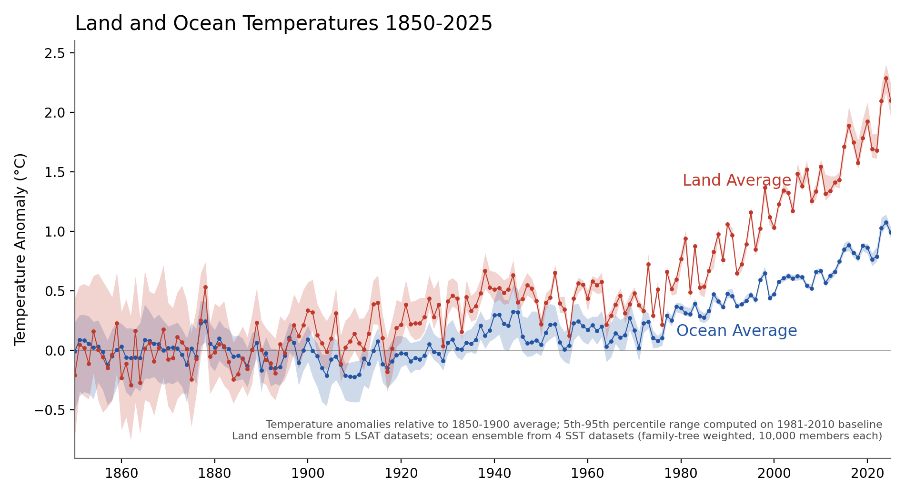

# Land and Ocean Temperature Ensembles

10,000-member annual ensembles of **global land surface air temperature
(LSAT)** and **global sea surface temperature (SST)**, 1850–2025, built
from five LSAT products and four SST products via a Thorne et al. (2026)
style family-tree weighting. Each component product contributes either a
native ensemble or a σ-synthesized / donor-imputed pseudo-ensemble; the
final 10,000 draws sample across products by equal-weight method
families.

This work uses the same overall framework as the Thorne et al. (2026)
SST-grouped GMST ensemble, but applied to LSAT and SST separately so
that downstream analyses can decompose GMST structural uncertainty by
component.

## Headline result



| Year | LSAT median | LSAT 5–95% | SST median | SST 5–95% |
|------|------------:|----------:|----------:|---------:|
| 1850 | −0.21 °C    | −0.72 to +0.44 | −0.01 °C | −0.50 to +0.24 |
| 1900 | +0.34 °C    | +0.11 to +0.57 | +0.09 °C | −0.10 to +0.21 |
| 1950 | +0.22 °C    | +0.12 to +0.28 | +0.05 °C | −0.05 to +0.26 |
| 2000 | +1.03 °C    | +1.01 to +1.05 | +0.47 °C | +0.46 to +0.48 |
| 2024 | +2.29 °C    | +2.16 to +2.40 | +1.08 °C | +1.04 to +1.14 |

*Anomalies relative to the 1850–1900 average. Percentiles are computed
on the 1981–2010 modern baseline (where the ensembles have minimum
spread by construction) and then shifted by a constant offset so the
median has zero mean over 1850–1900 — the "modern baseline plus
offset" approach. This preserves the modern-era uncertainty
representation while reporting against preindustrial. Offsets:
land +1.03 °C, ocean +0.48 °C.*

## Datasets

### LSAT (5 products)

| Dataset | Native ensemble | Time | Source |
|---------|-----------------|------|--------|
| Berkeley Earth High-Res Land | 10 native members | 1750–2026 | `berkeleyearth.org` |
| CRUTEM 5.1.0.0 | No (200 synth from σ) | 1850–2026 | `metoffice.gov.uk/hadobs/crutem5` |
| GloSATLAT 1.0.0.0 | No (200 synth from σ) | 1781–2021 | CEDA (`catalogue.ceda.ac.uk`) |
| DCLSAT (DCENT v3.0 land field) | 200 native members | 1850–2025 | Harvard Dataverse `doi:10.7910/DVN/NU4UGW` |
| NOAA Land v6.1.0 | No (DCLSAT donor) | 1850–2026 | `ncei.noaa.gov/.../noaa-global-surface-temperature/v6.1` |

### SST (4 products)

| Dataset | Native ensemble | Time | Source |
|---------|-----------------|------|--------|
| HadSST 4.2.0.0 | 200 native bias members + σ noise | 1850–2026 | `metoffice.gov.uk/hadobs/hadsst4` |
| ERSSTv6 (NOAA pre-release ensemble) | 1000 native members (1850–2024) + Option B fallback for 2025 | 1850–2025 | `ncei.noaa.gov/pub/data/cmb/ersst/v5/tmp/ersstv6.ensemble/` (contact `boyin.huang@noaa.gov`) |
| COBE-SST 2 | No (HadSST4 donor) | 1850–2026 | NOAA PSL mirror of JMA |
| DCENT SST (v3.0) | 200 native members | 1850–2025 | Harvard Dataverse `doi:10.7910/DVN/NU4UGW` |

## Methodology

See the two methodology documents:

- [`land_ensemble_methodology.md`](land_ensemble_methodology.md)
- [`ocean_ensemble_methodology.md`](ocean_ensemble_methodology.md)

Both follow the same five-step structure: (1) annualize & truncate to
1850–2025; (2) build a per-dataset 200-member (or native 10-member)
ensemble; (3) re-baseline to 1981–2010 member-wise; (4) apply a method-
family tree to assign leaf probabilities; (5) sample 10,000 final
members by primary-leaf assignment + within-leaf member draw.

The family trees are visualised in `family_tree_land.png` and
`family_tree_ocean.png`.

## Repository contents

```
land_ocean_temps/
├── README.md                         # this file
├── land_ensemble_methodology.md
├── ocean_ensemble_methodology.md
│
├── download_data.sh                  # fetch raw datasets into Land Data/ + Ocean Data/
├── pull_dcent_lsat_members.py        # data prep: DCENT 200 LSAT members
├── pull_dcent_sst_members.py         # data prep: DCENT 200 SST members
├── pull_ersstv6_members.py           # data prep: ERSSTv6 1000 native members
├── prepare_hadsst_global_ensemble.py # data prep: HadSST4 gridded → 200 globals
├── prepare_cobe_global_mean.py       # data prep: COBE-SST2 NetCDF → anomaly CSV
├── dcent_member_fileids.json         # Harvard Dataverse manifest for DCENT v3.0
│
├── build_land_ensemble.py            # core: 10,000-member LSAT builder
├── build_ocean_ensemble.py           # core: 10,000-member SST builder
│
├── plot_land_ensemble.py             # plot: land best estimate + 95% band
├── plot_ocean_ensemble.py            # plot: ocean best estimate + 95% band
├── plot_land_ocean_combined.py       # plot: land + ocean overlay
├── plot_family_trees.py              # plot: dendrogram for each family tree
│
├── land_ensemble.csv                 # output: 176 × 10,001
├── land_ensemble_summary.csv         # output: annual mean, p2.5/50/97.5, σ
├── land_ensemble_perdataset.csv      # output: per-dataset mean and σ
├── ocean_ensemble.csv                # output: 176 × 10,001
├── ocean_ensemble_summary.csv
├── ocean_ensemble_perdataset.csv
│
└── *.png                             # figures
```

## Reproduction

### 1. Environment

```bash
python3 -m venv venv && source venv/bin/activate
pip install numpy pandas xarray netCDF4 matplotlib
```

### 2. Download raw datasets

Run `bash download_data.sh` from the repo root (creates `Land Data/`
and `Ocean Data/` with all required files). Total download ≈ 2.5 GB
of which 1.7 GB is the HadSST4 200-member gridded ensemble. After
extraction the raw NetCDFs are deleted by the prep scripts — final
on-disk footprint is closer to 100 MB.

The HadSST4 gridded ensemble dominates the download. If you only
want the central estimates and the σ-synthesized pseudo-ensembles
you can skip the four HadSST4 ensemble zips (`*_ensemble_members_*`)
and edit `prepare_hadsst_global_ensemble.py` accordingly — but you
will lose the native bias-dimension covariance.

### 3. Prepare derived global means (one-time)

```bash
python3 pull_dcent_lsat_members.py            # ~15 min, ~5 GB transient
python3 pull_dcent_sst_members.py             # ~15 min, ~5 GB transient
python3 pull_ersstv6_members.py               # ~2.7 hr, ~135 MB transient (iterative)
python3 prepare_hadsst_global_ensemble.py     # ~30 s
python3 prepare_cobe_global_mean.py           # ~5 s
```

These read from `Land Data/` and `Ocean Data/` and write derived CSV
files alongside their inputs.

### 4. Build the ensembles

```bash
python3 build_land_ensemble.py
python3 build_ocean_ensemble.py
```

Writes `land_ensemble.csv`, `ocean_ensemble.csv`, summary CSVs, and
per-dataset diagnostics.

### 5. Plot

```bash
python3 plot_land_ensemble.py
python3 plot_ocean_ensemble.py
python3 plot_land_ocean_combined.py
python3 plot_family_trees.py
```

## Citation

If you use these ensembles, please cite the underlying methodology paper:

> Thorne, P. W. et al. (2026). *A framework for an operational
> assessment of observed global warming-to-date*. ESSD preprint
> [`https://doi.org/10.5194/essd-2025-825`](https://doi.org/10.5194/essd-2025-825).

…together with the individual dataset references listed in the two
methodology MDs.

## License

Code: MIT (see `LICENSE`). Output ensemble CSVs are subject to the
licenses of their underlying input datasets — see the methodology MDs
for per-dataset references and licensing terms (CRUTEM5 / HadSST4 /
GloSATLAT: Open Government Licence v3; NOAA / NCEI: public domain;
Berkeley Earth: CC BY 4.0; DCENT: CC0 via Harvard Dataverse;
COBE-SST2: NOAA PSL terms).
